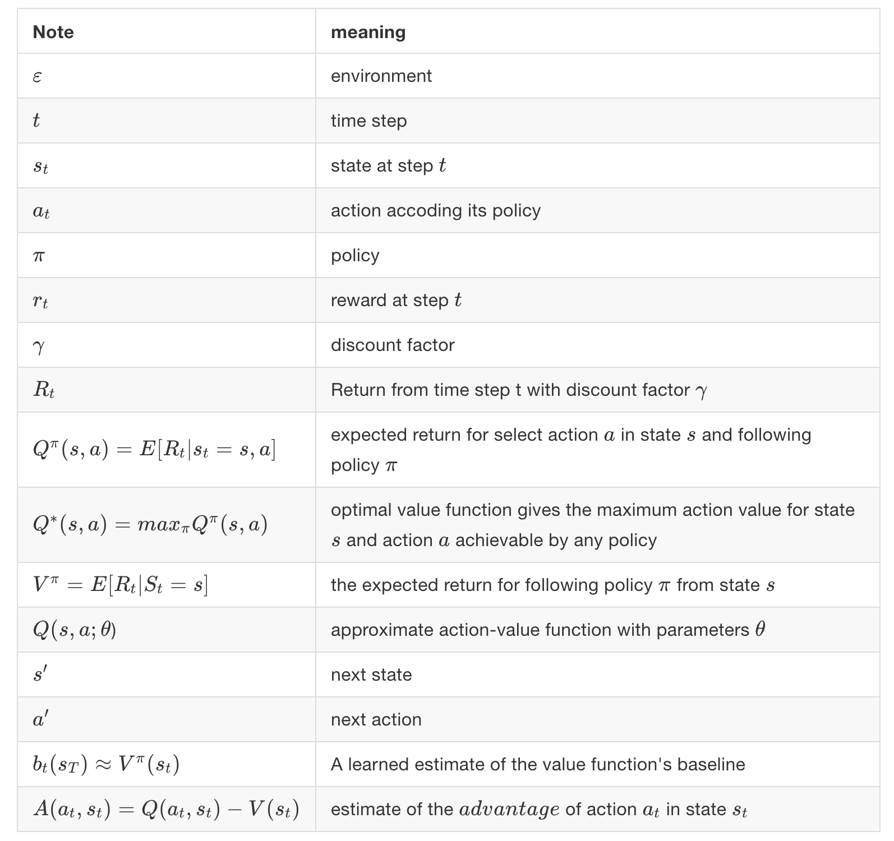
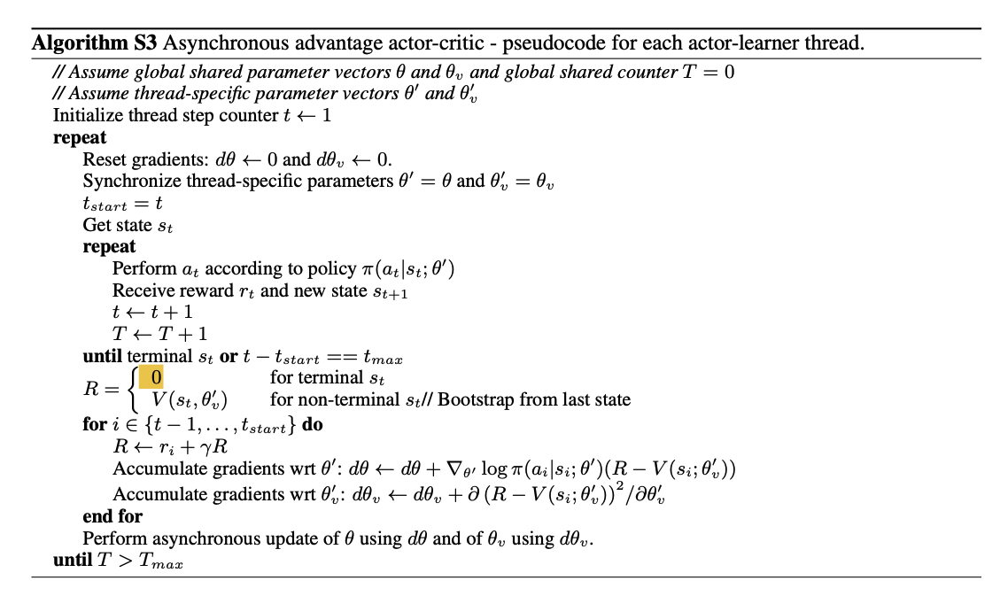

# A2C
A2C is a synchronous, deterministic variant of Asynchronous Advantage Actor Critic (A3C)
- Original paper:
    - [A3C](https://arxiv.org/pdf/1602.01783.pdf)
    - [Acktr:(ACKTR (pronounced “actor”) — Actor Critic using Kronecker-factored Trust Region)](https://arxiv.org/pdf/1708.05144.pdf)
- Baselines post: TODO
- `python3 -m tbase.run --alg=a2c_acktr --max_iter_num=500 --policy_net=LSTM_MLP_A2C --seed 9` runs the algorithm for about 122000 days = 500 episode on a tgym.average environment. See help (`-h`) for more options.

## A3C

## 异步RL框架
- 单机多线程的方式，降低了gradients和parameters通信成本
- Hogwild! style updates for training
- 并行运行多个actor, 探索环境的不同部分
- 在多个环境中的不同部分并行探索，online updates, 降低actor与环境之间的相关性
- 不使用replay memory

优势：
- 减少训练时间，与并行的actor数量呈线性关系
- on-policy 的方式

Asynchronous advantage actor-critic(A3C)

